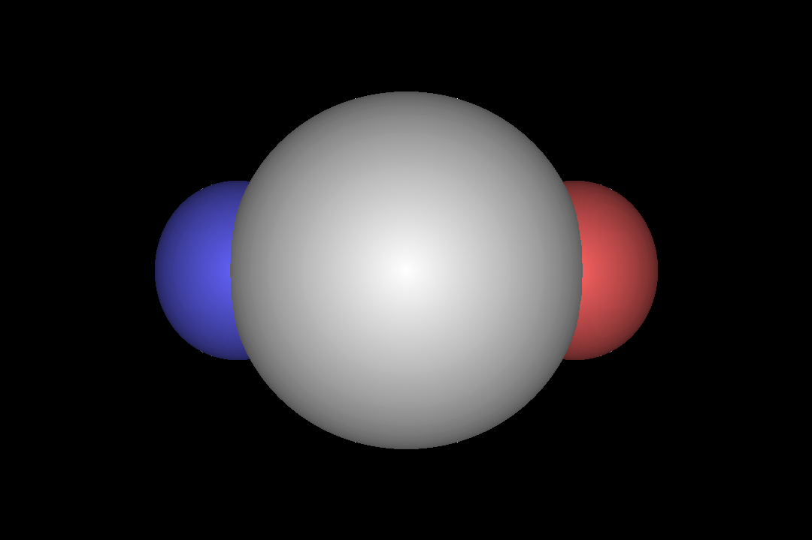

# An educational ray marcher implemented in python

the main.py contains a prebuild scene and camera where you can start off.

## TODOs

 * [ ] The Camera class is buggy for almost all camera angles
 * [ ] Show image while it's being rendered (maybe on a canvas)
 * [ ] Create UI with parameters
 * [ ] Speed it up (experiment with threadcount, batchsize, etc)
